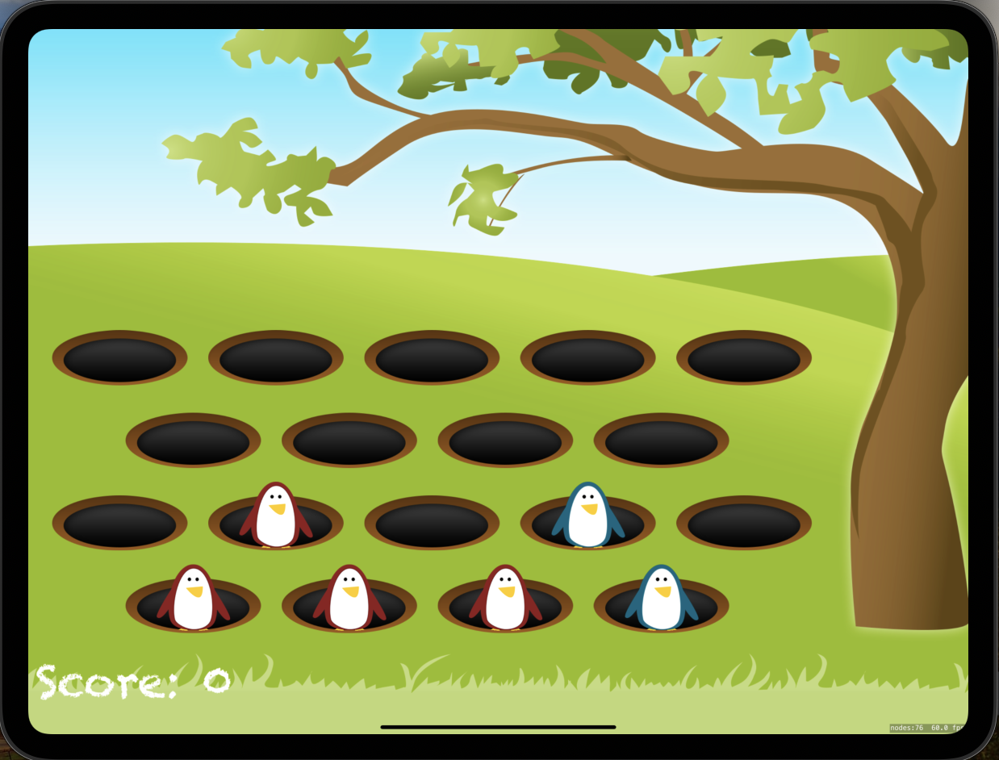
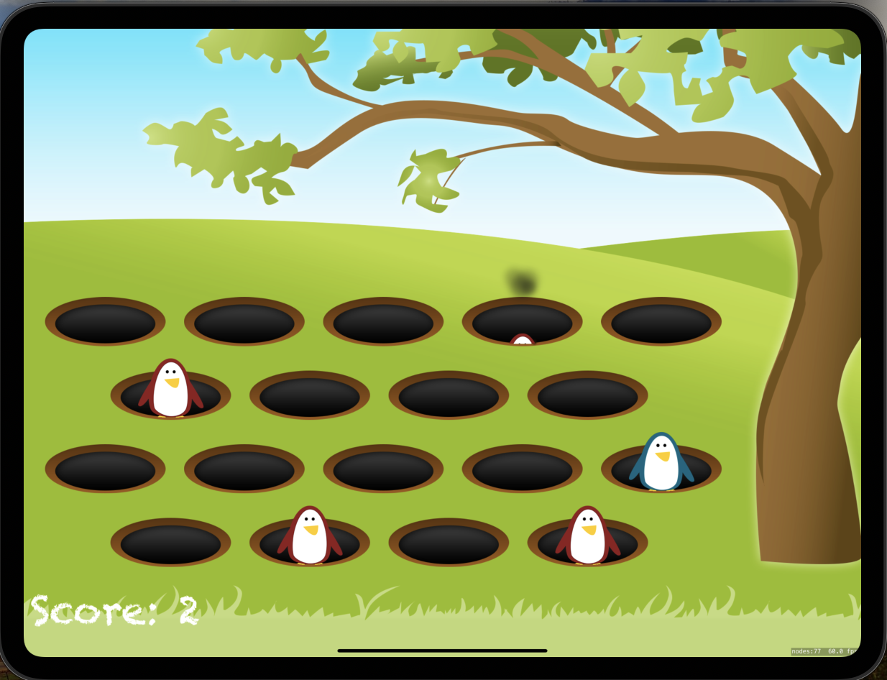

# Project14: Whack-a-Penguin

This is a SpriteKit-based game where the player whacks penguins popping out of holes. The goal is to score points by hitting evil penguins while avoiding friendly ones.

## Features

* Whack penguins as they pop out of holes
* Score points by hitting evil penguins
* Lose points by hitting friendly penguins
* Dynamic game difficulty with increasing speed
* Visual effects and sound effects to enhance gameplay

## Screenshots

  

  

## Game Rules

* Penguins (either good or bad) randomly pop out of the holes
* The player taps on the penguins to hit them
* Good penguins deduct points when hit, bad penguins add points
* The game ends after a set number of rounds

## Controls

* Tap on the screen to hit penguins

## Technical Requirements

* iOS 12.0+
* Xcode 12.0+
* Swift 5.0+

## Possible Development

* Add different types of characters with unique behaviors
* Implement power-ups and special abilities
* Enhance visual effects with more animations
* Add more sound effects and background music
* Introduce a leaderboard and achievements system
